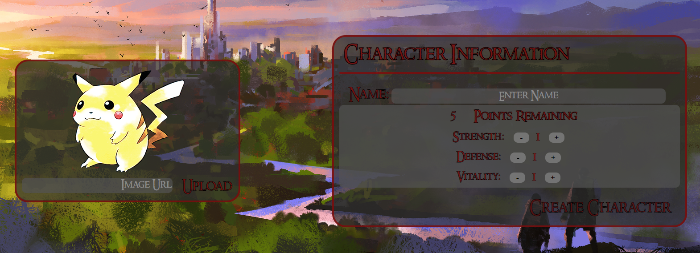
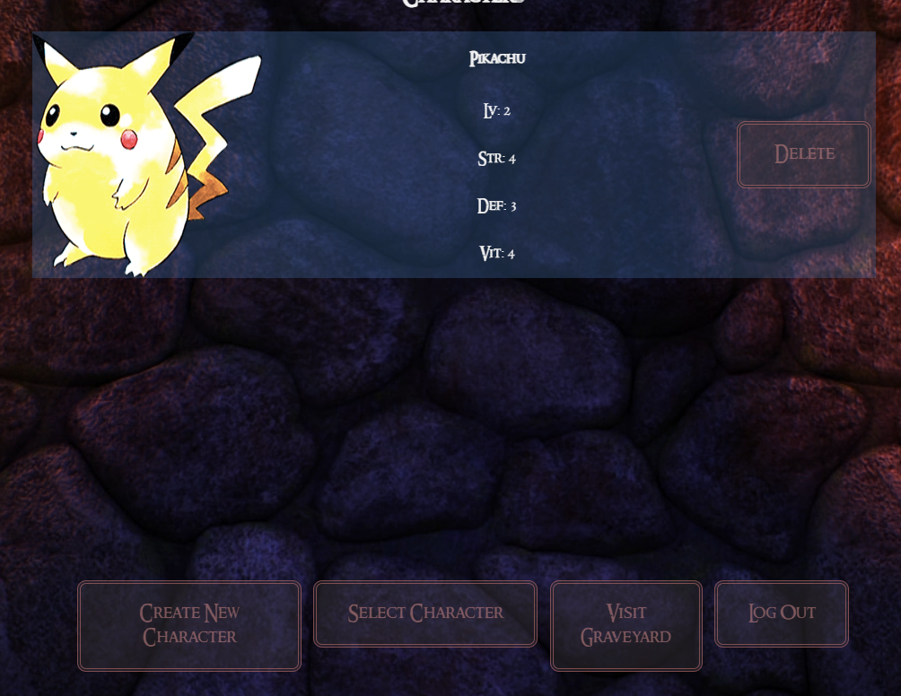
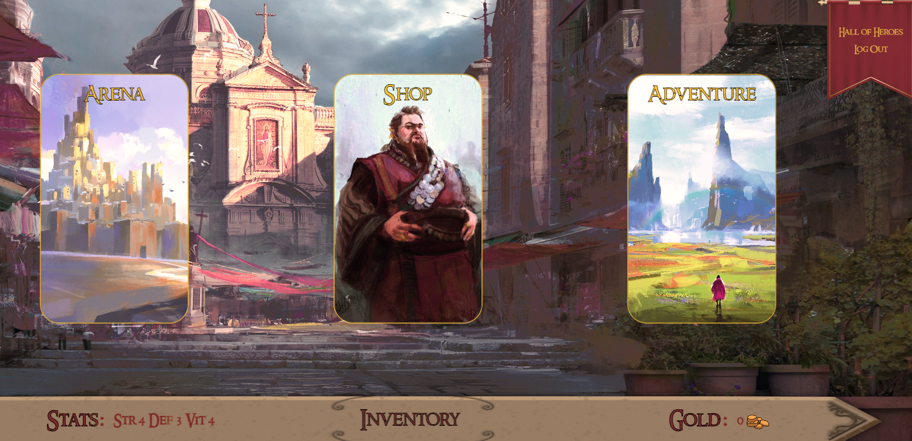
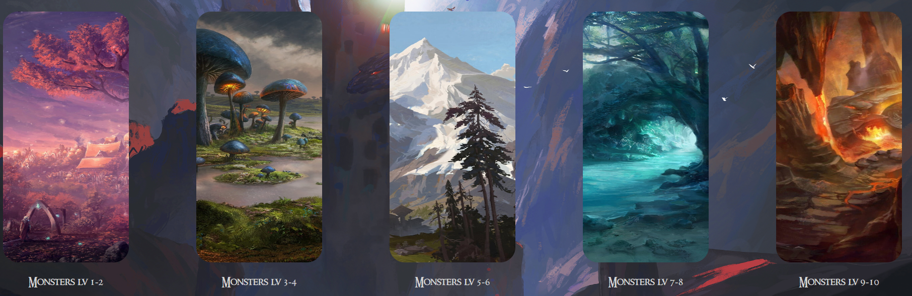
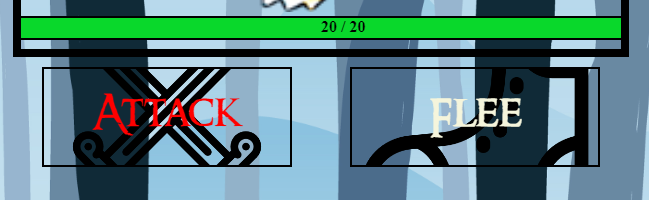

# RPG_Sim

## Description
Welcome to RPG the Game, where you create characters and battle it out with Monsters to see who will be the last one standing. Can you survive? If you want a less challenging fight maybe try your hand in the arena!

## Installation
None required. Visit the [website](https://rpgthegame.herokuapp.com/) in order to play the game!

## Usage
In order to play our game visit this [page](https://rpgthegame.herokuapp.com/). Once you are there you will need to create a new account. Once created you will be directed to the character creation page. From there you can upload an image to represent your character. You will also be directed to input a name and spend points however you decide to select your starting stats.

After your first character is created, you will then be directed to the character landing where you can select which character to begin the game with, create a new character, or visit the graveyard. 

Once in the game you will have the option to visit a shop, where you can buy items once you get some money, visit the arena where you can test your self against other characters, or go on an adventure to find some monsters. 

On the adventure page you will be given the option to visit one of five regions which have varying ranges of levels that can be encountered, so be careful!

Once in combat you are given two options. Attack or Flee. If you Attack both sides will attack each other and a log on the right side will display what happened. If you flee the enemy will get one last attack in before you are able to return to town.

## Credits
- Chrissna [github](https://github.com/ChrissnaKhiev)
- Hunter [github](https://github.com/hdyoung21)
- Diego [github](https://github.com/Stiicer)
- Background Images From: [Liuzishan](https://www.freepik.com/author/liuzishan)
## License
N/A